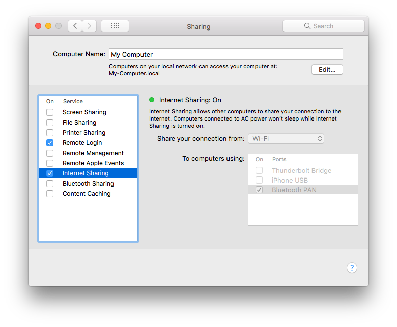

# wifi-tethering

- [wifi-tethering](#wifi-tethering)
  - [Setup your Mac as wifi AP](#setup-your-mac-as-wifi-ap)
  - [Enable port forwarding](#enable-port-forwarding)
  - [Setup port forwarding rules](#setup-port-forwarding-rules)
  - [Apply port forwarding rules to main config](#apply-port-forwarding-rules-to-main-config)
  - [Start / Stop port forwarding](#start--stop-port-forwarding)
  - [Configure sudoers to allow mitmproxy to access pfctl](#configure-sudoers-to-allow-mitmproxy-to-access-pfctl)
  - [Start mitmproxy](#start-mitmproxy)
  - [Setup mitmproxy certificates](#setup-mitmproxy-certificates)
  - [References](#references)

## Setup your Mac as wifi AP

System Preferences => Sharing

<p align="center">
  
</p>

## Enable port forwarding

Add following to `/etc/sysctl.conf`.

```
net.inet.ip.forwarding=1
net.inet6.ip6.forwarding=1
```

## Setup port forwarding rules

Add following to `/etc/pf.anchors/http`. This will forward all incoming packets to localhost:8080 which there will be mitmproxy running.

Note: `bridge100` is your incoming network interface. In this case, it's our wifi interface.

```
rdr pass on bridge100 inet proto tcp from any to any port 80 -> localhost port 8080
rdr pass on bridge100 inet proto tcp from any to any port 443 -> localhost port 8080
```

## Apply port forwarding rules to main config

Add following to `/etc/pf.conf`.

```
# After rdr-anchor "com.apple/*"
rdr-anchor "http-forwarding"

# After load anchor "com.apple" from "/etc/pf.anchors/com.apple"
load anchor "http-forwarding" from "/etc/pf.anchors/http"
```

## Start / Stop port forwarding

Start

```
sudo pfctl -ef /etc/pf.conf
```

Stop

```
sudo pfctl -d
```

## Configure sudoers to allow mitmproxy to access pfctl

Add following to `/etc/sudoers`.

```
ALL ALL=NOPASSWD: /sbin/pfctl -s state
```

## Start mitmproxy

```
mitmproxy --mode transparent --showhost
```

## Setup mitmproxy certificates

Visit [mitm.it](mitm.it) from your client devices.

## References

- https://www.jianshu.com/p/6052831a8e91
- https://gist.github.com/kujohn/7209628
- https://www.trustwave.com/Resources/SpiderLabs-Blog/Intercepting-SSL-And-HTTPS-Traffic-With-mitmproxy-and-SSLsplit/
- https://docs.mitmproxy.org/stable/howto-transparent/
- https://medium.com/bugbountywriteup/intercepting-network-data-with-mitmproxy-on-macos-3e3f2f0123b2
- https://github.com/brannondorsey/mitm-router
- https://github.com/xdavidhu/mitmAP
- https://romainpellerin.eu/hacking.html

Port forwarding

```
iptables -t nat -A PREROUTING -i wlan1 -p tcp --dport 80 -j REDIRECT --to-port 8080
iptables -t nat -A PREROUTING -i wlan1 -p tcp --dport 443 -j REDIRECT --to-port 8080
```
